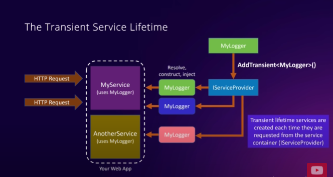
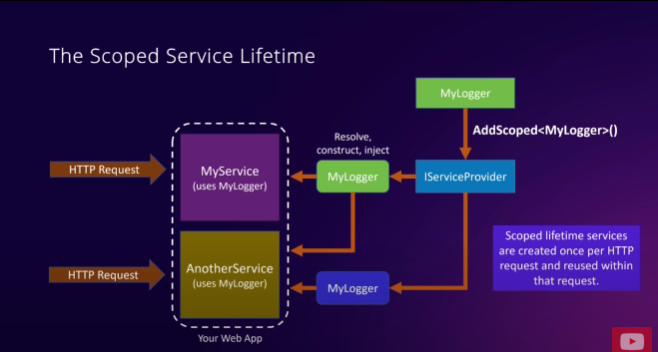
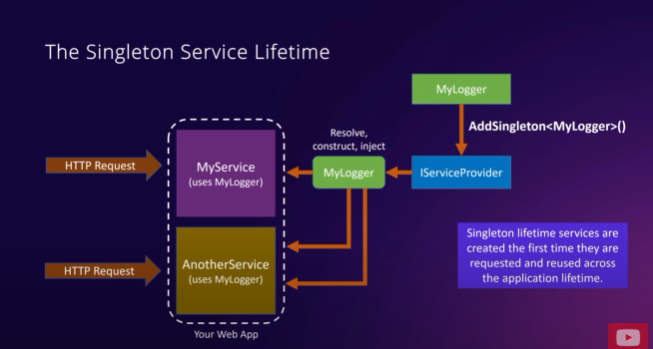
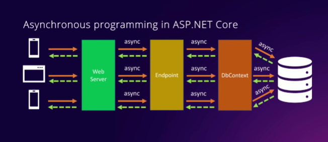

# Notas C# .NET

## Extensiones: 
- C# dev kit
- C# 
- IntelliCode for C#
- Rest client
- Sqlite

## Comandos: 
- Inicializar proyecto: 

- Obtener posibles opciones de proyectos:
    - dotnet new list 

- Obtener info de dotnet:
    - ```dotnet --version```
    - ```dotnet --info```

## Notas
- Se puede inicializar proyectos a través de la UI si se instala el devkit de C#: 
    - Ctrl + Shift + P -> .NET: New project

- Usar explorador de solución para visualizar estructura de proyecto.
- Los archivos .csproj permiten definir cuestiones relacionadas al proyecto en el que se está trabajando:
    - Sdk del proyecto
    - Grupos de propiedades de configuración

- Los archivos .json permiten realizar diversas configuraciones que no deberían ser hardcodeadas y que podrían cambiar entre entornos (strings de conexión a db, por ejemplo). 
    - Existen tres archivos de configuración: 
        - appsettings.json -> Ejecutable en entorno de producción
        - appsettings.Development.json -> Ejecutable en entorno de desarrollo
        - launchSettings.json -> Permite definir "Perfiles": 
            - Los perfiles permiten definir configuraciones para solo entornos de desarrollo cuyos efectos se ven al ejecutar localmente (URLs en ejecución local, environmentVariables que definen el tipo de entorno, por ejemplo)
            - Los perfiles por default son HTTP y HTTPS

- Las carpetas /bin y /obj contienen archivos temporales:
    - /bin -> Contiene los archivos finales (.DLL) o ensamblados para la aplicación.
    - /obj -> Contiene archivos intermedios que se manipulan durante el proceso de compilación.

- Maneras de construir (build) la aplicación:
    - Usando el explorador de la solución: 
        - Sobre el proyecto actual en el explorador: Click derecho -> Build 
    - Usando la consola (terminal dedicada): 
        - ```dotnet build```
        - Se puede realizar el build de la ubicación en la que se esté asignado:
            - En el caso de estar en la raíz del proyecto, se va a construir la solución.
            - En caso de esta sobre un proyecto particular, se va a construir el proyecto en sí. 
    - Usando la combinación CTRL + SHIFT + BUILD 

- Los archivos DLL creados a partir de la construcción de un proyecto se guardan en: 
    - bin/Debug/net9.0 (debug solo si se está en entorno de desarrollo, la versión de .NET puede variar)

- Ejecutando la aplicación luego de construirla: 
    - Pulsando F5 (con el archivo a ejecutar abierto), luego elegir C# y luego elegir la configuración definida (.json) para ejecutar la aplicación.
        - Esta ejecución implica una sesión de debug. 
    - Se puede ejecutar un proyecto (o solución) sin tener el soporte de debug ya que podría consumir tiempo (se ejecuta más rápido):
        - En el explorador de la solución: 
            - Click derecho sobre el proyecto -> Debug -> Start without debugging 
    - Ejecución con la consola: 
        - ```cd /carpeta-proyecto``` (contiene el archivo .cs) -> ```dotnet run```

## API
- Una API define la funcionalidad que se le provee a los clientes.

### Rest
- Representational State Transfer -> Define un conjunto de principios que imponen las condiciones de cómo una API debería funcionar.
    - Cliente-servidor
    - Interfaz uniforme
    - Sistema en capas
    - Cacheable
    - Sin estado
    - Código a demanda

- Una API rest o más conforman al estilo de arquitectura REST.

## Recursos de una API
- Un recurso es cualquier objeto, documento o elemento que la api puede recibir o enviar a los clientes.
    - Juegos, usuarios, documentos, etc.
- Los recursos se almacenan bajo determinado dominio, el cual puede ser público, privado o local. 
- Se puede acceder a estos recursos a través del protocolo HTTP/HTTPS.

### Identificar uniforme de recursos (Uniform Resource Identifier - URI)
- Es un identificador que los clientes utilizan para identificar y manipular los recursos de una API rest.

## Interacciones con una API
- Cuando los clientes necesitan utilizar los recursos, estos envían peticiones HTTP/HTTPS al servidor usando el URI, para obtener una respuesta por parte de este servidor. 
- Las peticiones y respuestas varían dependiendo el método HTTP que se esté utilizando:
    - GET
    - POST
    - PUT
    - DELETE
    - PATCH
- Las respuestas de las operaciones con los métodos HTTP suelen incluir el código HTTP de la operación y la información que está siendo manipulada (o contenido nulo en caso de operar con DELETE).

## Códigos más usuales en respuestas
- 200 -> Success
- 201 -> Created
- 404 -> Not found
- 400 -> Bad request
- 401 -> Forbidden
- 500 -> Internal server error

# Data Transfer Objects - DTOs (También llamados "contracts")
- Son objetos que transportan información entre procesos o aplicaciones. 
- Encapsulan información de manera simple y estandarizada que puede ser fácilmente transmitida entre diferentes capas de una aplicación o incluso entre diferentes aplicaciones. 
- También se llama a los DTOs "contracts/contratos" ya que representan un acuerdo compartido entre el cliente y el servidor acerca de cómo la información debe ser enviada, no es recomendable implementar código de acceso a datos en estos elementos.
- Estos DTOs pueden llevar "data annotations", los cuales son atributos para las propiedades que pueden definir qué se espera para cada propiedad necesaria.

# Archivo .csproj
- Este archivo permite definir la configuración general del proyecto e incluso las referencias a los paquetes obtenidos desde NuGet
- Ejemplo de instalación con CLI desde NuGet: 
```shell
dotnet add package MinimalApis.Extensions --version 0.11.0
```
# Entity Framework Core - ORM
- Ayuda a escribir código para interactuar con una base de datos sin necesidad de aprender un nuevo lenguaje.
- Un ORM permite establecer un mapeo entre las entidades de la base de datos y las interfaces en el código, ya que casi siempre hay una correspondencia entre la existencia de ambos (interfaces/modelos y tablas).
- Un ORM es una técnica para convertir datos entre una base de datos relacional y un programa orientado a objetos.
- EF Core es un ORM ligero, extensible, de código abierto y multiplataforma para .NET.
    - Puede traducir el código de acceso a datos en C# a sentencias SQL que el servidor de base de datos puede entender.
    - Los datos resultantes de una operación pasan a través de EF Core para transformarlos en objetos que la API puede entender.
    - El código de acceso a datos se escribe utilizando LINQ.
    - Herramientas disponibles para mantener los modelos de C# sincronizados con las tablas de la base de datos.
    - EF puede realizar un seguimiento de los cambios realizados en las instancias en tiempo de ejecución, por lo que sabe qué cambios enviar a la base de datos cuando es necesario persistir datos.
    - Soporta múltiples proveedores de bases de datos.

## DbContext
- Un DbContext es un objeto que representa una sesión de conexión con la base de datos y puede ser utilizado para consultar y guardar instancias, actuando como intermediario.
    - Relacionado con los patrones Repository y Unit of Work:
        - DbContext es una combinación de ambos patrones.

# Sistema de configuración de ASP.NET Core 
- El string de conexión suele definirse en appsettings.json tanto para entornos de producción como para entornos de desarrollo, al igual que otras configuraciones relacionadas con la aplicación.
- El archivo appsettings.json se conoce como "fuente de configuración" ya que permite realizar otros tipos de configuraciones, tales como: 
    - Argumentos de CLI
    - Variables de entorno
    - Secretos de usuario (User secrets)
    - Fuentes de configuración basadas en la nube, como Azure Key Vault.
- En tiempo de ejecución, ASP.NET Core se encarga de combinar la información de todas las fuentes de configuración disponibles en un único objeto de configuración que implementa la interfaz **IConfiguration**.
    - Este objeto de configuración es fácilmente accesible para la API REST de manera que no necesita saber de dónde provienen los datos de configuración.
    - Durante el desarrollo, al usar una base de datos con credenciales, se recomienda utilizar secretos de usuario (user secrets) para evitar la exposición de datos sensibles.
        - Utiliza la fuente de configuración de secretos habilitada por el administrador de secretos de ASP.NET Core.

# Migraciones de base de datos
- EF Core posee un proceso que toma todas las entidades definidas para el modelo de datos y las convierte en sus correspondientes tablas en la base de datos.
- Comando para realizar migraciones: 
```shell
dotnet ef migrations add MigrationName --output-dir FolderName/(folderName)
```

- Comando para deshacer migraciones:
```shell
dotnet ef migrations remove
```


## Logs y limpieza de consola
- Es posible omitir logs en la consola de las operaciones que se realizan mediante la definición de la prioridad de los valores que se emiten desde la herramienta que ejecuta tales logs, por ejemplo: 
```json
"Logging": {
    "LogLevel": {
      "Default": "Information",
      "Microsoft.AspNetCore": "Warning",
      "Microsoft.EntityFrameworkCore.Database.Command": "Warning"
    }
  },
```
- "Microsoft.EntityFrameworkCore.Database.Command": permite emitir logs de las operaciones de base de datos en EF.

# Inyección de dependencias
- Clases: 
    - X: MyService
    - Y: MyLogger
- La inyección de dependencias consiste en la utilización de características de una determinada **X clase** en determinada **Y clase** en la cual se crea una instancia de la clase X.
    - Esto sugiere un problema si en la clase X se crease una instancia de la clase Y usando **new** ya que si en el futuro se decidiera modificar la clase Y, la funcionalidad implementada en la clase X fallaría. Es decir, **los cambios aplicados en la clase X van a influir en la clase Y, lo cual va a implicar realizar cambios en ambas clases**. 
    - La clase X necesita saber cómo construir y configurar la dependencia de la clase Y
    - Se dificulta la posibilidad de testear la clase X ya que la clase Y no se puede mockear o stubbear.

- Para solucionar este problema, la clase Y se debe enviar (inyectar) a través del constructor de la clase X.
    - De esta manera la clase X no necesita saber cómo está configurada la clase Y.
    - ASP .NET Core provee la interface IServiceProvider (conocida como ServiceContainer), esta interface permite que se registren dependencias durante la inicialización del proyecto.
    - Cuando se detecta una petición HTTP, este provider se encarga de resolver, construir e injectar las dependencias de la clase Y en el constructor de una nueva instancia de la clase X, lo cual implica los siguientes beneficios: 
        - La clase X no se verá afectada por los cambios en sus dependencias. 
        - La clase X no necesita saber cómo construir o configurar sus dependencias ya que no va a estar creando instancias de ellas (en este case de la clase Y).
        - En el caso de usar **minimal APIs**, las dependencias también se pueden inyectar como parámetros a los endpoint de las minimal APIs.
        - La inyección de dependencias permite la **inversión de dependencias**. 
            - El principio de inversión de dependencias consiste en que el código solo debería depender de abstracciones en lugar de implementaciones concretas (se cambia de ejemplo):
            - La clase MyService podría depender de la interface ILogger ya que esta está siendo implementada por las clases MyLogger y CloudLogger para emitir mensajes de log.
            - A través del uso de esta interface, la clase MyService NO debe ser cambiada y la interface ILogger permite declarar los métodos de log necesarios para que tanto la clase MyLogger como la clase CloudLogger se encarguen de darle su funcionalidad correspondiente. 
            - De esta manera la clase MyService no debe ser modificada y evita la dependencia de las clases MyLogger y CloudLogger
        - La realización de tests sobre la clase MyService es más fácil dado que sus dependencias pueden ser mockeadas o stubbeadas.
        - El código es más limpio y se reusa con más facilidad.

## Ciclo de vida de un servicio
- Durante la inicialización, la aplicación va a registrar las dependencias de sus servicios (MyLogger) para que luego al momento de detectar una petición HTTP, el contenedor de servicios (o dependencias) se encargará de resolver, construir e inyectar una instancia del servicio (MyLogger) en una nueva instancia de la clase que la necesita (MyService). 

### ¿Qué sucede cuando se detecta una nueva petición HTTP o si otro servicio también depende de la misma clase que depende la clase que ya ejecutó la petición HTTP?
- El tiempo de vida de un servicio se configura cuando se registra un servicio en el contenedor de dependencias.
    - Por ejemplo, la clase MyService junto con otra clase tienen dependencia de la clase MyLogger. Por lo que cuando se detecta una petición HTTP ejecutada por la clase MyService, se resuelve, construye y crea una instancia de la clase MyLogger.
- Existen tres ciclos de vida de los servicios: 
    1. **Ciclo de vida transiente**: Ocurre en un escenario en el cual la clase MyLogger es ligera y no tiene estado, por lo que está bien crear una instancia cada vez que una clase la necesita.
    1.1. Esto se realiza con el método **.AddTransient<MyLogger>()**: Cuando la primera petición HTTP se detecta, el contenedor de dependencias (IServiceProvider (o Service Container)) se va a encargar de resolver, construir e inyectar una nueva instancia de la dependencia MyLogger en una nueva instancia de la clase MyService. 
    1.2. Cuando una nueva petición HTTP se detecta, el contenedor de dependencias va a construir e inyectar una nueva instancia de MyLogger, la cual no tendrá nada que ver con la instancia ya creada.
    1.3. Si existe otro servicio que participa en cualquiera de estas peticiones HTTP y tiene una dependencia de MyLogger, también va a recibir una nueva instancia de MyLogger, la cual no tendrá relación con las demás instancias ya creadas. 
    1.4. Los ciclos de vida transientes de los servicios se crean cada vez que estos servicios son solicitados desde el contenedor de dependencias (IServiceProvider (o contenedor de servicios)).
    
    2. **Ciclo de vida encapsulado (scoped)**: Ocurre en un escenario en el cual una clase (MyLogger en este ejemplo) mantiene cierto estado que se necesita compartir a través de diferentes clases que participan en una petición HTTP.
    2.1. La clase (MyLogger) cuyo estado se debe compartir se registra en el contenedor de dependencias (IServiceProvider) mediante el método **.AddScoped<MyLogger>()**. 
    2.2. En este caso, cuando una petición HTTP sea detectada, el contenedor de dependencias se va a encargar de resolver, construir e inyectar una nueva instancia de la dependencia en el servicio.
    2.3. Si hubiere otro servicio que también participa en la misma petición HTTP y que también tiene dependencia en la clase que se resuelve, construye e inyecta (MyLogger) en el primer servicio mencionado, este también va a recibir exactamente la misma instancia de la dependencia que recibió el primer servicio.
    2.4. En el caso de que una nueva petición HTTP se detecte en el segundo servicio mencionado, el contenedor de dependencias va a crear e inyectar una nueva instancia en él, la cual va a ser diferente y no va a estar relacionada con la primera instancia correspondiente a la primera petición HTTP.
    2.5. Los ciclos de vida encapsulados (scoped) para los servicios son creados de a una vez por cada petición HTTP detectada y se reutilizan dentro de esa misma petición.
    
    3. **Ciclo de vida Singleton**: sucede cuando una determinada clase (dependencia) es un tanto pesada y tiene determinado estado que se debe compartir con todas las clases que la solicitaron durante todo el ciclo de vida de la aplicación. 
    3.1. Se debe registrar la dependencia en el contenedor con el método **.AddSingleton<MyLogger>()**.
    3.2. Cuando una petición HTTP es detectada, el contenedor de dependencias (IServiceProvider) se encargará de resolver, construir e inyectar una nueva instancia de esta dependencia en la instancia del servicio. 
    3.3. Si existe otro servicio que participa de la misma petición HTTP y también tiene dependencia con la clase (MyLogger), este servicio también va a recibir la misma instancia de la dependencia. 
    3.4. Si una nueva petición HTTP es detectada, el contenedor de dependencias va a encargarse de proveer nuevamente la misma instancia de la dependencia (MyLogger) a cualquiera de las clases (servicios) que la necesiten durante la ejecución de la aplicación.
    4. Los ciclos de vida singleton se crean la primera vez que se solicitan y se reutilizan durante el ciclo de vida de la ejecución de la aplicación. 
    

# Ejecutando tareas asíncronas y sus beneficios

- Mejor rendimiento: Se evitan bloqueantes en las llamadas, lo cual permite realizar varias peticiones para lograr una mejor calidad en la responsividad.
- Mejor escalabilidad: Se logra que la aplicación maneje más peticiones y usuarios simultáneamente sin dejar que la aplicación se bloquee por esperar peticiones de operaciones para completar.
- Código más simplificado: El código asíncrono es simple de escribir mediante objetos **Task** y las keywords **async-await**. Lo cual logra generar una manera simple e intuitiva de escribir código asíncrono, lo cual no ocurre al momento de trabajar con hilos y callbacks.
- Para crear operaciones asíncronas, se usan las keywords **async** (para determinar la naturaleza del método a ejecutar en el endpoint), **await** (para determinar si la interacción con el contexto de la base de datos va a implicar una espera de los resultados) y los métodos predefinidos con el sufijo **Async** (e.g. .ToListAsync()) para realizar las operaciones asíncronas en el contexto de la base de datos.

# Cómo consumir la API desde el cliente (con blazor)
- Se debe añadir la dirección de la API en el archivo appsettings.json ubicado en el cliente.